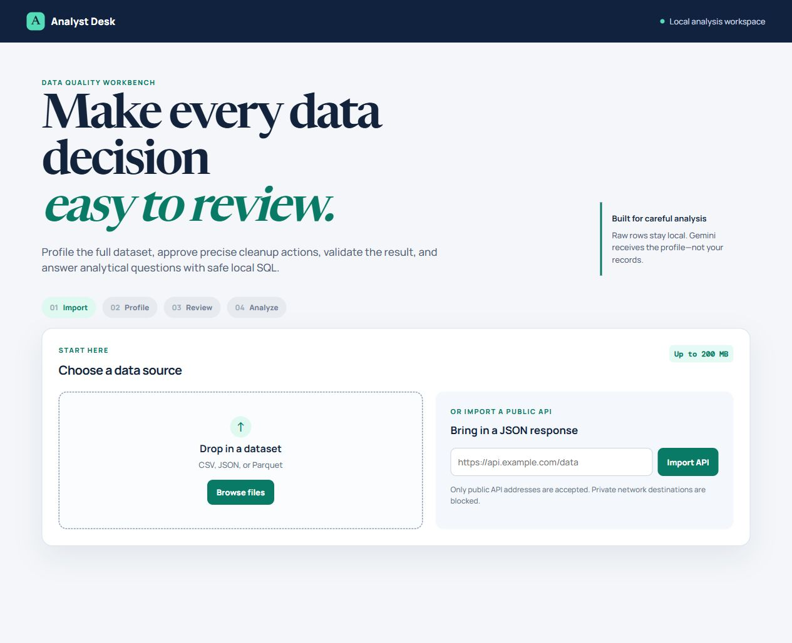
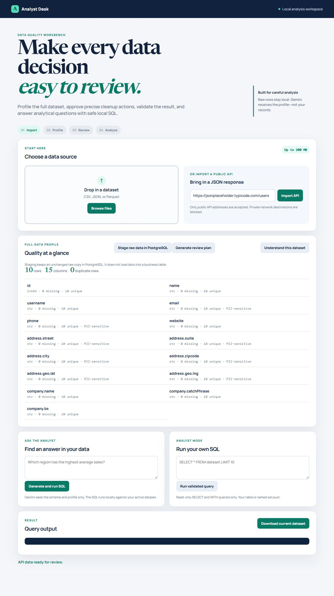
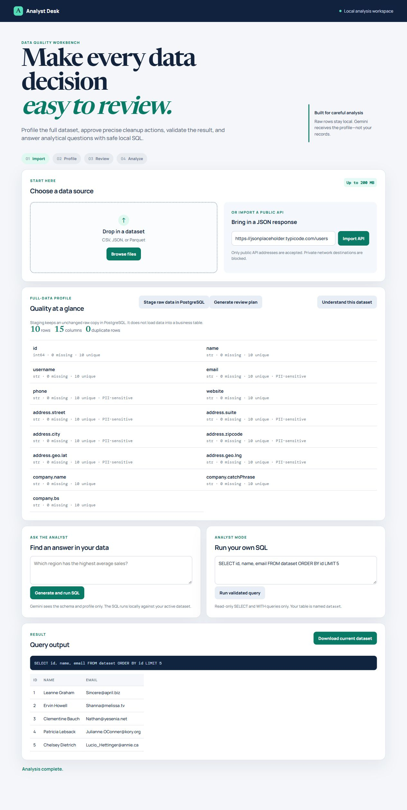

# Analyst Agent

> A reviewable AI data-quality and analytics workspace for raw files, public APIs, and PostgreSQL.

**Analyst Agent** transforms the original SQL Analyst and ETL Analyst prototype into a browser-based portfolio application. Users can upload a CSV, JSON, or Parquet file (up to 200 MB), inspect a full-dataset quality profile, review cleaning suggestions, stage an unchanged raw copy in PostgreSQL, and answer questions through guarded local SQL.

The design is deliberately conservative: AI helps explain and propose; deterministic services validate and execute locally; users approve changes.

## The analyst workflow

1. **Ingest** a file or public JSON API response.
2. **Profile** every row locally for nulls, duplicates, type issues, zeros, distinct values, and potential PII.
3. **Understand** an unfamiliar dataset with a profile-grounded orientation and starter questions.
4. **Review** conservative cleanup recommendations before changing anything.
5. **Validate** before/after quality results and download the current dataset.
6. **Analyze** with natural-language or explicit, read-only SQL.
7. **Map and reconcile** source files against a PostgreSQL target table around an approved ETL load.

## Product walkthrough

### Import a raw file or public API

The workspace accepts CSV, JSON, and Parquet files. It can also import a public JSON endpoint with response-size limits and private-network blocking.



### Profile the complete dataset

After import, Analyst Agent profiles the active dataset locally: row count, column count, duplicate rows, types, missing values, zero values, distinct values, and potential PII-sensitive columns. These checks occur before cleanup is proposed.



### Review decisions instead of opaque automation

The app presents cleanup as a review plan. The user chooses suggestion IDs to approve; it applies only deterministic changes and returns a validation report. Ambiguous business decisions, including whether a market or financial value should be imputed, remain human decisions.

### Ask questions safely with local SQL

A user can ask a natural-language question or write their own query. Gemini receives the schema and profile—not raw browser-uploaded records. The resulting SQL runs locally against an in-memory DuckDB table called `dataset`; only validated `SELECT` and `WITH` statements run.



## Core capabilities

| Area | What it does |
| --- | --- |
| Dataset ingestion | Reads CSV, JSON, and Parquet files up to 200 MB; imports bounded public JSON APIs. |
| Data profiling | Measures full-dataset nulls, duplicates, zeros, distinct counts, types, and potential PII. |
| Dataset orientation | Produces an AI-assisted description, likely row grain, field guide, caveats, and starter questions. |
| Reviewable cleanup | Suggests conservative actions; users explicitly approve individual actions before deterministic transformations run. |
| Missing-value safety | Detects missingness without inventing financial or market values such as bid, ask, and prior-close prices. |
| SQL analysis | Generates schema-grounded SQL from a question or accepts user SQL; runs it locally after read-only validation. |
| PostgreSQL exploration | Supports schema inspection, explicit read-only queries, and natural-language queries against PostgreSQL. |
| ETL readiness | Maps source fields to a target table and identifies unmapped fields / missing required target fields. |
| ETL reconciliation | Compares source and target row counts after a separately approved load. |
| Raw-data staging | On explicit request, stores unchanged source rows in generic PostgreSQL JSONB staging tables. |

## Architecture

```text
                         ┌─────────────────────────────┐
                         │        Analyst Desk UI       │
                         │     FastAPI + HTML/CSS/JS    │
                         └──────────────┬──────────────┘
                                        │
                 ┌──────────────────────┴──────────────────────┐
                 │       Original ApplicationDataAgent facade    │
                 └──────────────┬────────────────┬──────────────┘
                                │                │
                  ┌─────────────▼──────┐  ┌──────▼─────────────┐
                  │ Dataset ETL Agent  │  │ Local SQL Agent    │
                  │ profile / plan /   │  │ question → SQL /   │
                  │ approve / validate │  │ validated execution│
                  └─────────────┬──────┘  └──────┬─────────────┘
                                │                │
                   ┌────────────▼───────┐  ┌─────▼─────────────┐
                   │ pandas + local disk│  │ DuckDB (local)    │
                   └────────────────────┘  └───────────────────┘

            Optional PostgreSQL: read-only exploration, mapping,
               reconciliation, and explicit generic raw staging
```

### Prototype continuity

This is not a replacement for the original project. The delivery layer calls the existing `ApplicationDataAgent` facade in `agents/aiagent.py`, which routes work to the existing ETL and SQL agents. Model selection continues to use `utils/llm_pick.py`:

- **Low / Medium** — Gemini Flash Lite for routine profile-based suggestions and SQL tasks.
- **High** — Gemini Flash for more demanding reasoning.

Set `LLM_THINKING_LEVEL` to `low`, `medium`, or `high`; the example configuration uses `medium`.

## Technology

- Python 3.12+, FastAPI, Uvicorn
- Pandas for ingestion, profiling, and deterministic cleanup
- DuckDB for isolated local dataset analysis
- PostgreSQL + psycopg2 for guarded database workflows
- Gemini via Google GenAI for optional profile-grounded language tasks
- LangGraph / LangChain components from the original prototype
- Pytest, Ruff, Docker, and Docker Compose

## Quick start

### Configure

```powershell
uv sync --group dev
Copy-Item .env.example .env
```

Set `GEMINI_API_KEY` in `.env` to enable AI suggestions, dataset orientation, and natural-language SQL. Profiling and direct local SQL are still useful without an API key.

### Run

```powershell
uv run uvicorn ai_agent.api:app --reload
```

Open [http://127.0.0.1:8000](http://127.0.0.1:8000).

### Test the workflow

Upload a file from `data/test-data/`. `messy_retail_orders.csv` intentionally contains duplicates, inconsistent text, missing values, zeros, and negative values to exercise the review workflow.

## PostgreSQL ETL workflow

The repository includes a local ride-sharing schema for demonstrations. Configure the database values, then load the seed data once:

```powershell
uv run python feed_db.py
uv run ai-agent schema
```

The loader preserves existing records unless `RESET_DATA=true` is set.

### Map a source to a target

Before an approved load, compare CSV/JSON/Parquet source fields with an existing target table:

```powershell
uv run ai-agent map data/rides.csv public.rides
```

The output reports exact source-to-target matches, unmapped source fields, and required target fields that need a human decision.

### Reconcile after a load

After a separately approved ETL load, compare source and target row counts:

```powershell
uv run ai-agent reconcile data/rides.csv public.rides
```

`map` and `reconcile` are non-destructive. They use the original ETL agent facade and never insert, update, or delete business-table records.

### Stage raw data explicitly

**Stage raw data in PostgreSQL** is intentionally separate from loading a business table. Configure a writer role with `DB_WRITE_*` values, then stage an unchanged raw copy to:

- `etl_staging.datasets` — source metadata and schema context
- `etl_staging.dataset_rows` — heterogeneous source rows stored as JSONB

This preserves an audit/reprocessing copy without forcing arbitrary source columns into `public.rides`, `public.payments`, or another modeled table.

## Configuration

Copy `.env.example` to `.env`. Never commit the real file.

| Variable | Purpose |
| --- | --- |
| `GEMINI_API_KEY` | Enables Gemini-powered profile interpretation and generated SQL. |
| `LLM_THINKING_LEVEL` | `low`, `medium` (default), or `high`; uses `utils/llm_pick.py`. |
| `DB_HOST`, `DB_PORT`, `DB_NAME`, `DB_USER`, `DB_PASSWORD` | Read-only PostgreSQL connection for exploration, mapping, and reconciliation. |
| `DB_WRITE_*` | Separate writer credentials for explicitly requested generic raw staging. |
| `MAX_UPLOAD_MB` | Upload ceiling; default `200`. |
| `MAX_API_RESPONSE_MB` | Public API response ceiling; default `25`. |
| `DATA_RETENTION_HOURS` | Local upload retention; default `24`. |
| `RATE_LIMIT_PER_MINUTE` | Per-client API request limit; default `30`. |
| `APP_API_KEY` | Optional API protection for non-public deployment. |

## CLI examples

```powershell
# Extract a public JSON API response.
uv run ai-agent extract https://pokeapi.co/api/v2/pokemon --output-dir data/extract --format csv

# Profile and clean a local file.
uv run ai-agent profile data/users.csv
uv run ai-agent clean data/users.csv data/cleaned/users.csv --remove-duplicates --trim-text

# Create a reviewable plan; apply only explicit approval IDs.
uv run ai-agent suggest-cleanup data/users.csv data/plans/users-cleanup.json
uv run ai-agent apply-plan data/users.csv data/plans/users-cleanup.json data/cleaned/users.csv --approve remove-duplicates --approve trim-text

# Query PostgreSQL through guarded routes.
uv run ai-agent query "SELECT DISTINCT payment_method FROM public.payments ORDER BY payment_method"
uv run ai-agent ask "Which five drivers completed the most rides?"
```

## Security and data handling

- Raw browser-uploaded rows stay on the application host; Gemini receives a profile/schema rather than raw records.
- PostgreSQL sessions use read-only mode and reject multiple statements and mutation/admin keywords.
- Local dataset analysis only accepts `SELECT` and `WITH` queries against a dedicated DuckDB table.
- Public API imports require HTTP(S), block private-network destinations, disable redirects, enforce timeouts, and cap response size.
- Cleanup is human-approved and deterministic; the app does not silently impute values with unknown business meaning.
- CSV downloads are spreadsheet-safe, and local uploads expire on the configured retention schedule.

For a public deployment, use HTTPS, a reverse proxy/WAF, a secret manager, encrypted persistent storage, outbound egress controls, and distinct least-privilege database roles.

## Testing

```powershell
uv run pytest -q
uv run ruff check src tests
```

**Current verification:** 26 automated tests passed.

## Repository layout

```text
agents/                 Original LangGraph analyst prototype and facade
models/                 Shared state and structured output contracts
utils/                  Existing LLM selector and support utilities
src/ai_agent/           FastAPI app, CLI, config, and safety services
src/ai_agent/web/       Browser UI assets
data/                   Ride-sharing seed data and portfolio test datasets
docs/screenshots/       Captured application walkthrough images
tests/                  Regression tests for quality, SQL, store, ETL, staging
feed_db.py              Local PostgreSQL schema/data bootstrap
```

## Limitations and next steps

- AI recommendations depend on the configured model and schema/profile quality; deterministic checks are the source of truth for counts and missingness.
- Mapping and reconciliation intentionally stop before business-table mutation; a human-approved loader is the next safe ETL enhancement.
- The current application is suited to local/single-user portfolio use. Multi-user production needs durable job queues, identity/roles, audit logging, observability, and managed object storage.

## Author

Built by [Vamsi Krishna Samavedam](https://github.com/VamsiKrishnaSamavedam) to demonstrate practical SQL analysis, ETL validation, data-quality review, and safe AI-assisted analytics.

